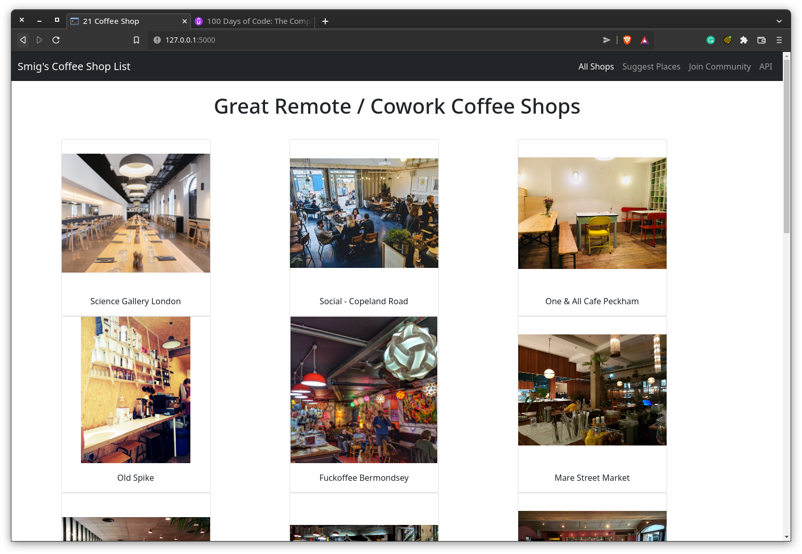

# Coffee Shop API 

Simple coffee shop finder web app, also has an API backend, and ability to add / remove cafes using the API.

Also included Dockerfile if you'd like to make changes




Improvements needed
- Improve Design
- Add Icons for Coffee Shop features
- Ability to filter through shops
- Add multiple cities
- Improve API backend


## Run from Docker image on docker hub
```
# Docker 
docker run -d -p 5000:5000 smiggiddy/coffee-app

```

## Sample API Response 

```
{
  "cafe": [
    {
      "can_take_calls": true, 
      "coffee_price": "\u00a32.40", 
      "has_sockets": true, 
      "has_toilet": true, 
      "has_wifi": false, 
      "id": 1, 
      "img_url": "https://atlondonbridge.com/wp-content/uploads/2019/02/Pano_9758_9761-Edit-190918_LTS_Science_Gallery-Medium-Crop-V2.jpg", 
      "location": "London Bridge", 
      "map_url": "https://g.page/scigallerylon?share", 
      "name": "Science Gallery London", 
      "seats": "50+"
    }, 
  ]
}
```

