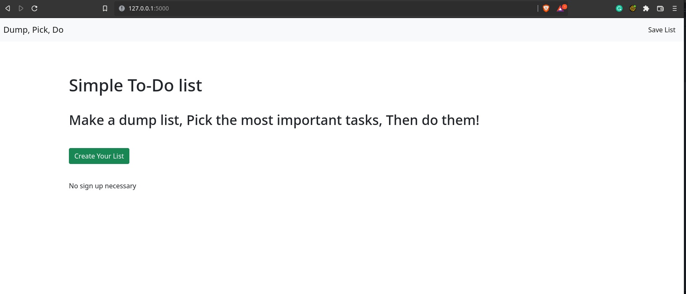
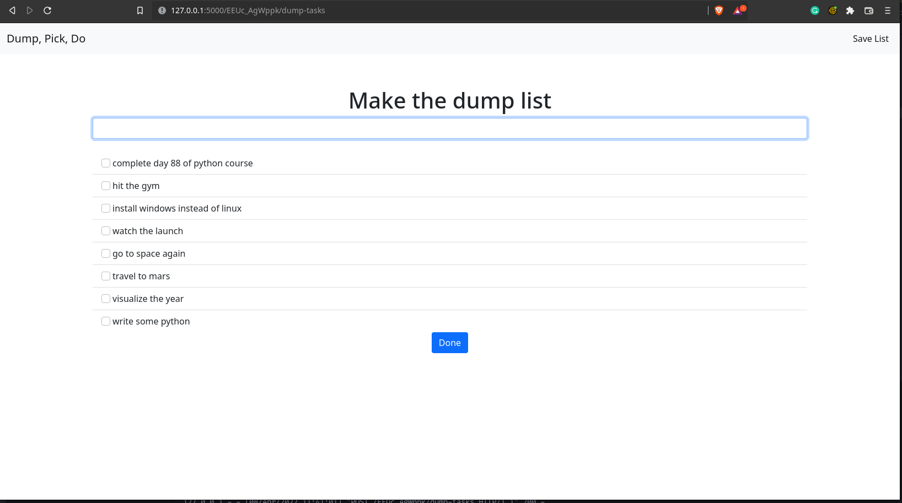
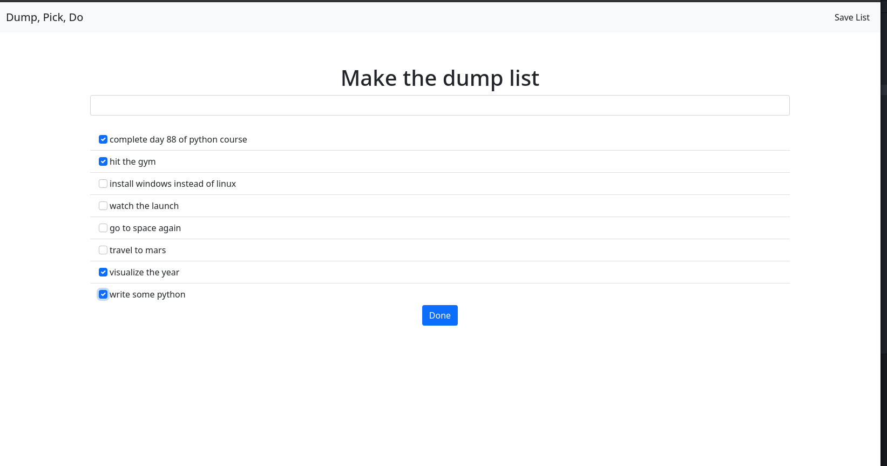
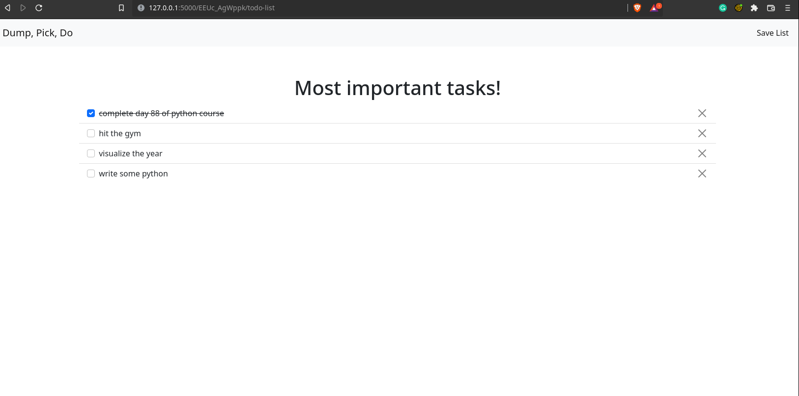

# Dump, Pick, Do

*Day 88 of 100 days of code*

Tasked with creating a TODO list. 

This is a pretty standard CRUD project, with one exception. I wanted to create my approach of getting things done. 

I like to list all tasks that need to be done and then pick the most important ones out of those tasks. I only focus on the important ones. 

The goal is simplicity, so one you're at the final list you either complete or delete the task from the list. 

## Screenshots:

**The Dump List:**

**Pick Tasks**

**Most important tasks!**

