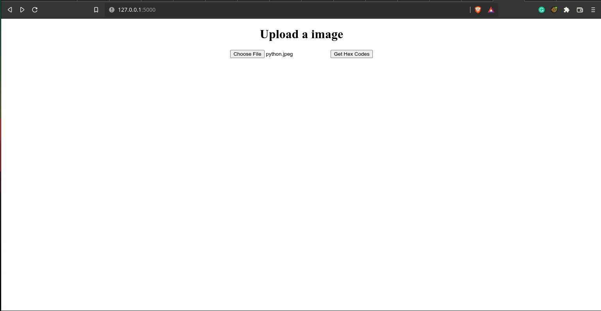
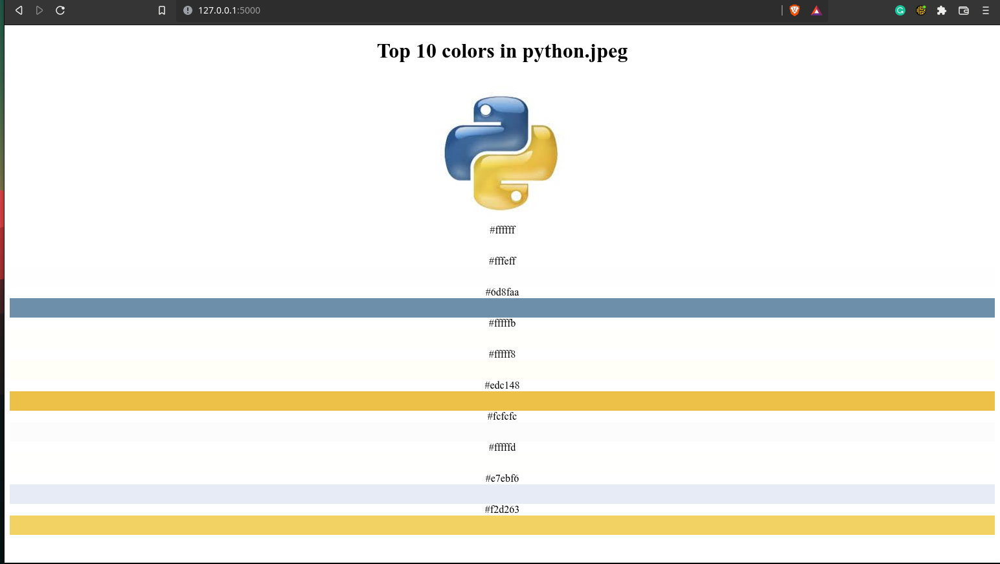

# 10 Most Common Hex Codes from an Image

This simple flask app returns the 10 most common hexcodes from an uploaded image.

This project uses pandas, PIL, FLask, and numpy to achieve the result. 

This is a featured backend project. 

# Screenshots 
## main page:

## results:
