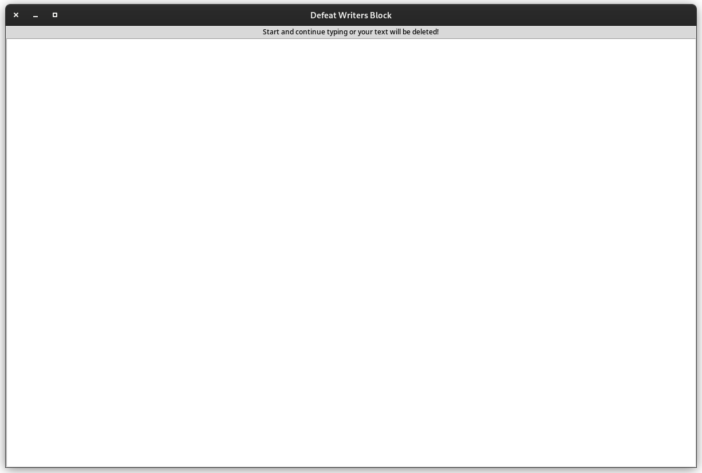

# Writers Block App

*Day 89 of 100 days of code*

Tasked with creating a writers block similar to [LINK](https://www.squibler.io/dangerous-writing-prompt-app) using Python's Tkinter. 

This project took about 45 minutes to code. I had to research the after and after cancel methods. 

I found these links helpful:
- [Python Guides Tkinter After Method](https://pythonguides.com/python-tkinter-after-method/)
- [Stackexchange post](https://stackoverflow.com/questions/37432598/wait-until-user-stopped-typing-in-tkinter)

Ideas for improvement: 

- make a countdown timer (maybe)
- could have a setting to append the text to a text file before deletion 

## Screenshot:

